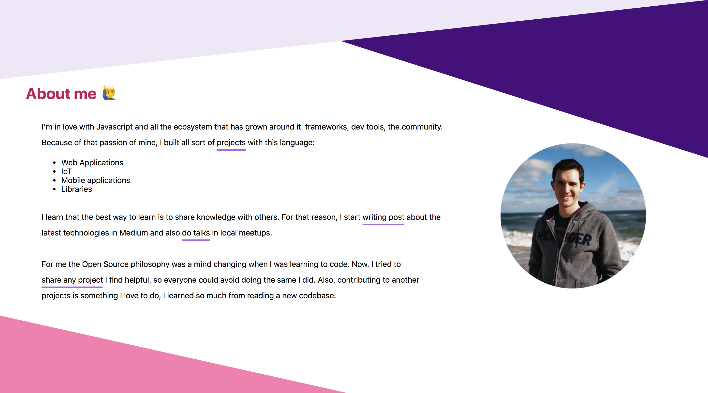
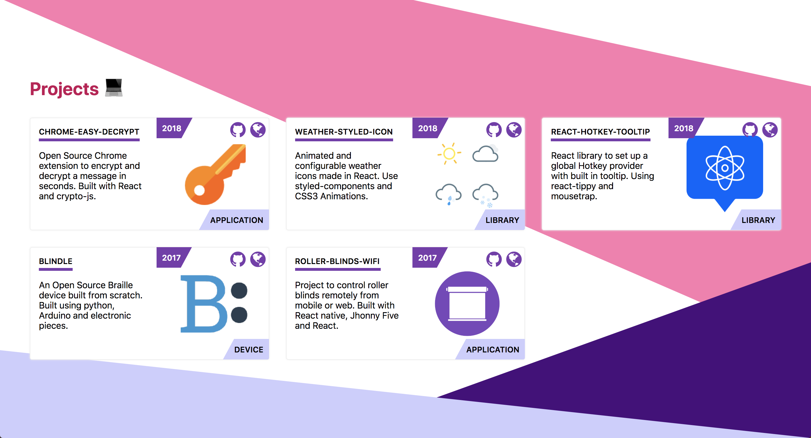
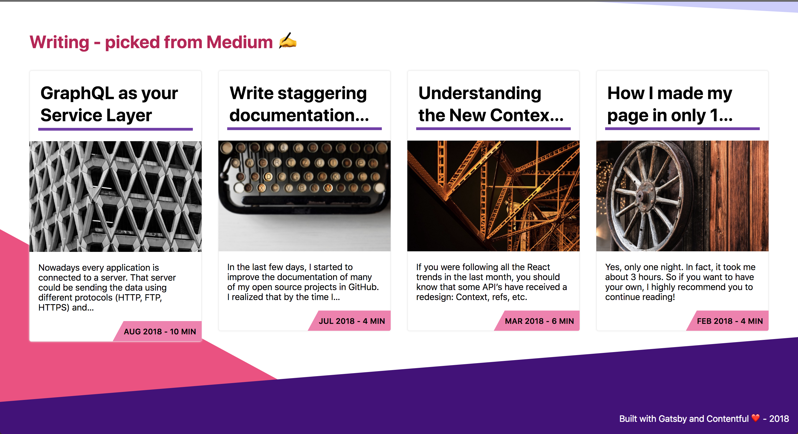
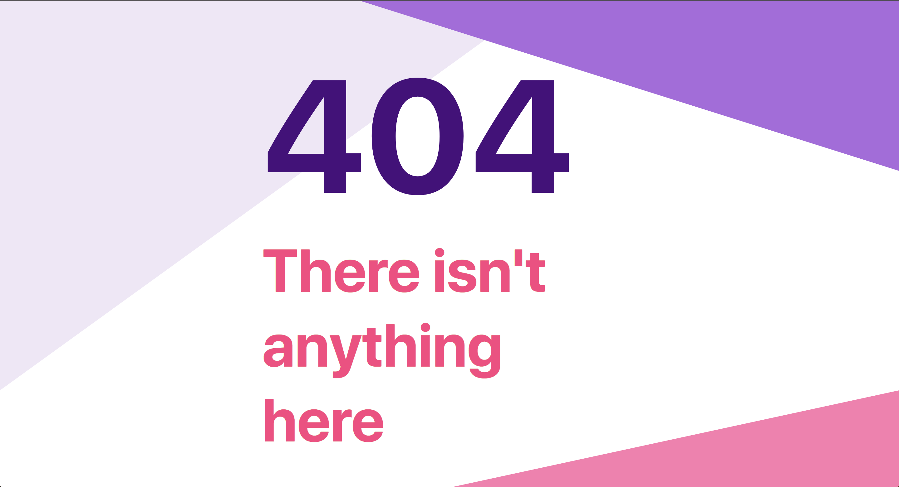

# Ema Suriano Portfolio

Hi 👋 This is my personal portfolio where I write a bit about me, the stuff I've worked and all the related links of me.

Feel free to use this portfolio as an example of yours 😄

The idea is to upload it to Gatsby template in the near future, in the meantime you can fork it.

## Features

- Gatsby v2
- Rebass (Styled-components system)
- Dynamic content from Contentful CMS
- Offline
- Lighthouse score of 93
- Offline support
- PWA ready
- SEO
- Google Analytics
- Responsive design
- Single page with scrolling behaviour
- Palette Theme by config
- React-headroom
- Font icons using font-awesome
- Google Analytics integration
- Netlify Deployment Friendly
- Medium syncronization
- Social sharing (Twitter, Facebook, Google, LinkedIn)
- Developer tools:
  - eslint
  - prettier
  - flow (incoming)

## Screenshots

Because it's always important to catch bad request, here it's the 404 :)

## License

MIT © Emanuel Suriano
