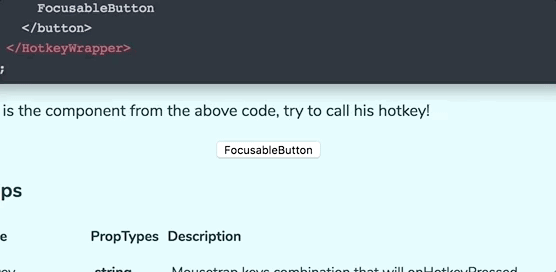

In the past month, I successfully wrote 2 libraries for any React application and I learned that building an Open Source library in Javascript is not an easy task at all 😣

Let's start from the beginning, why I even bother creating a library? As I said I've created 2 libraries, and the motivation was different in each case. But wait! What did I develop?

## [React Hotkey Tooltip](https://github.com/EmaSuriano/react-hotkey-tooltip)

### Context

I was working with a coworker on implementing a hotkey system inside a React application. The idea was to create something that allows the user to navigate the application without using the keyboard.

### What the library is

This is a React component that given a hotkey and a function, it will call that function when the hotkey is pressed. Also there is a helper hotkey (i.e. ?) that will display a tooltip with the hotkey inside.

### Why I decided to create it?

After writing something that works, we decided that it could be easily implemented into another project because it wasn't coupled to anything.

## [Weather Styled Icon](https://github.com/EmaSuriano/weather-styled-icon)

### Context

I was doing a forecast application just to have a Redux project, so then I could try doing integration test with [React Cosmos](https://github.com/react-cosmos/react-cosmos). While I was looking for weather Icons, I decided that I could create my own.

### What the library is

This a set of weather animated icons built with React. They are configurable by props, powered by [styled-components](https://github.com/styled-components/styled-components) (which is a library that allows writting CSS with Javascript) and animations only with CSS3.

### Why I decided to create it?

In this case, the idea of creating a library wasn't mine, in fact it was from a user on Twitter! After tweeting an image of how the application looks, someone asked me about the icons and how he could get them. And that was when I came up with the idea of the library, so huge thanks to that person 🙏

## The process of writing a library

I've never created a library for Javascript (more specially for React), maybe one or two for C# and C, but Javascript was different. The number of frameworks and tools that a person needs to know is really large! 😱

Let's summarize each part and divide them in mandatory and optional.

### Mandatory

* **Repository of Code**: We have to push our code into something, it could be a public or private repository but saving files locally doesn't work anymore. I used Github. Alternatives: Bitbucket, GitLab, etc.
* **Publication**: As we are creating a library, it has to be published inside a package manager in order to be download by anyone. I used npm. Alternatives: yarn.
* **README**: This is the documentation that every person will read after reaching your library, it has to explain what it does, how to install it, a few examples of uses, etc. I used [this template](https://github.com/dbader/readme-template) as a guideline.
* **Test coverage**: I marked this as Mandatory because many people refuse to use a library due to its coverage, and I agree with them. I don't want something inside my project that could break in any moment and I can't fix it immediately. I reached 100% of coverage in both libraries and used Coveralls to display it on the web. Alternatives: CodeClimate, CodeCov, etc.

### Optional

* **Demo Page**: If you write a good README, this task could be optional. What I like about Demo pages is that I can play with the library and see how it works in different situations. I wrote a Demo page for react-hotkey-tooltip and use React Storybook for weather-styled-icon. Alternatives: GitHub pages.
* **Continuous Integration**: I marked this as Optional because you can have an excellent library without it, but I can assure you that your life will be easier. Any CI framework can run your test, make the build, deploy your library to your package manager and more! I used Travis CI. Alternatives: Circle CI, GitLab CI, etc.
* **Semantic Versioning**: For anyone that doesn’t know what this means, is to upgrade version of your package based on your commit messages. This is great to enforce you to write meaningful commits! I used semantic-release.

## How to start?

So as you can see, there are a bunch of suggestions to take into consideration to create a library and fortunately there are some tools that will help you setting it all up!

I highly recommend using [nwb](https://github.com/insin/nwb)! This is a toolkit for quick development with React, Inferno, Preact or vanilla JavaScript. In simple words, it will give you a fully functional project to develop your library with the most used command: start, test and build.

Another great feature is that it comes with a full Travis CI configuration already made! So the only thing that you have to do is just enable Travis to run inside your repository via their page and it will automatically start running the project's setup 💪

Same goes to test coverage online reports, if you check the Travis configuration you will notice that the result of the coverage it's being sent to Coveralls, so the only thing that it's left to do is to activate in their page and that's it!

### What is missing to do:

#### Write the library 😂

This is the part when you have to code your library, inside the `src` folder plus writing your test into the `test` folder, and optionally write a simple demo inside the `demo` folder.

#### Deploy to a package manager

Depending on the one you've chosen the process would be different, so I will explain how it's like to deploy to npm. It's the easiest process but at some point could be a bit frustrating. The only command that you have to run is `npm publish`, and that's it! Your package will be ready to be installed from any console that runs `npm install my-package-name`.

But in case you re-run the command of `publish`, you will receive a warning saying that the version number can't be the same. So we have to manually change it from the `package.json` 😓 This takes less than a minute, but it could become very tiring at some point.

#### Set up Semantic Versioning

This tool can release you from the stress of changing that number each time you publish a release! Let's take a look at the description of semantic-release:

> semantic-release automates the whole package release workflow including: determining the next version number, generating the release notes and publishing the package.

This is soooooooooo magic ✨ To sum up, you only have to write commit messages following a specific format and this tool will upgrade the version of the package, create a release (similar to a changelog) and publish to a package manager! 🤩

## My experience through it all

After learning all this, I can tell you that you will be spending more time setting up all these tools than writing your library, which can sound a bit boring … But whenever you want to make a change on it, magically all the pieces will be already connected so your only concern will be coding, which is AWESOME! 🙌

I can assure you that it's not as hard as it seems, there a lot of learning to do but is not that difficult. There are plenty of resources for any possible problem out there, so in case you are stuck in something I bet you that it has happened to someone else before!

---

I hope that this post has encouraged you to create your own library! Let’s keep building stuff together 👷‍

### Refs:

* [Quick Development with nwb](https://github.com/insin/nwb/blob/master/docs/guides/QuickDevelopment.md#quick-development-with-nwb)
* [How to write an Open Source Javascript Library](https://egghead.io/courses/how-to-write-an-open-source-javascript-library)
* [Semantic-release](https://github.com/semantic-release/semantic-release)
