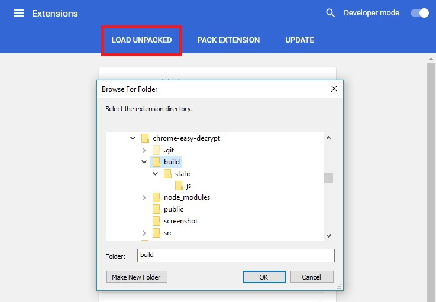
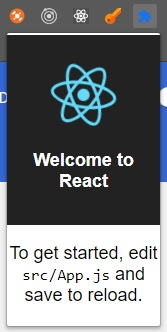
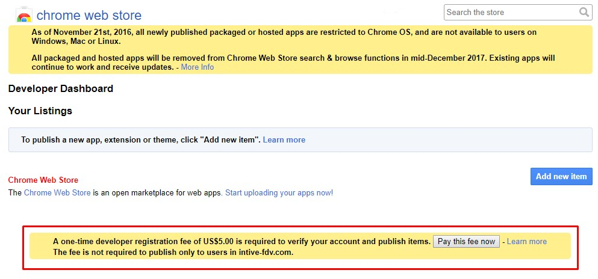
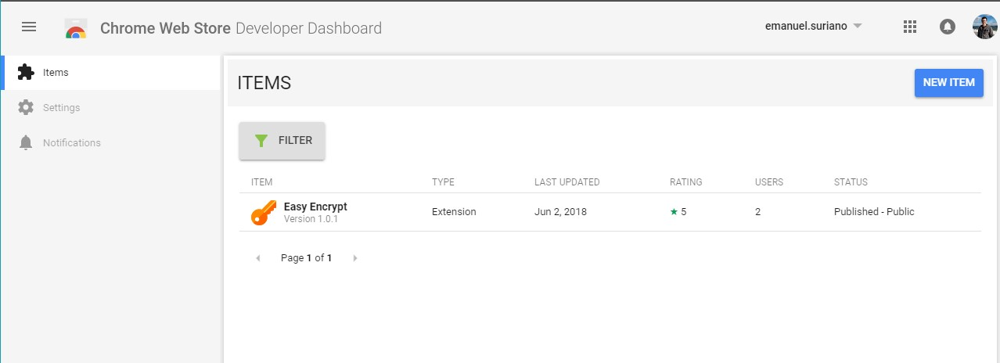
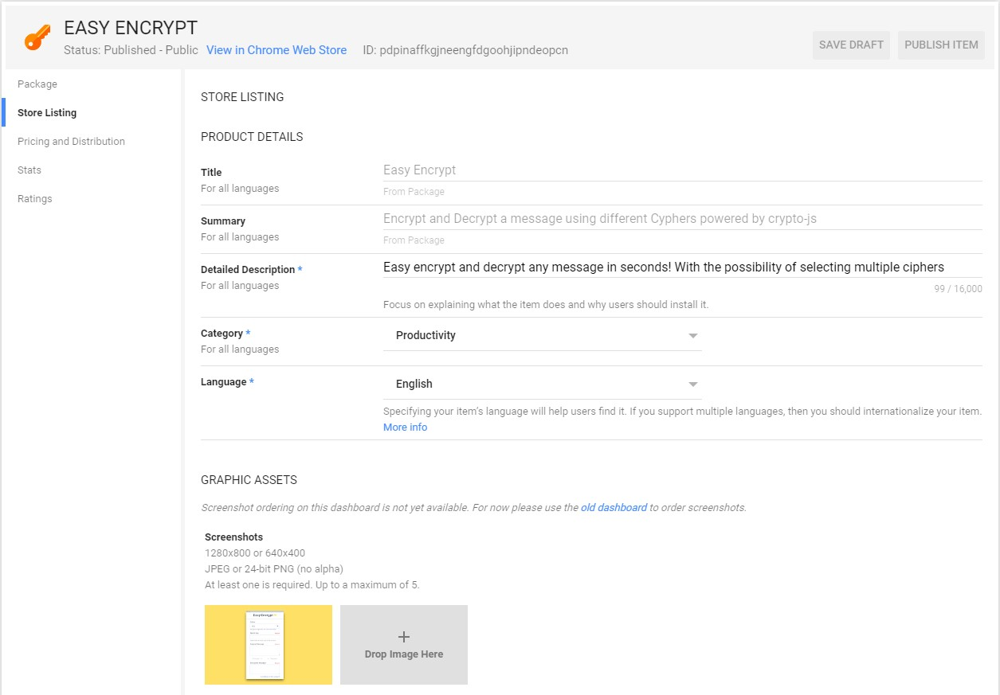
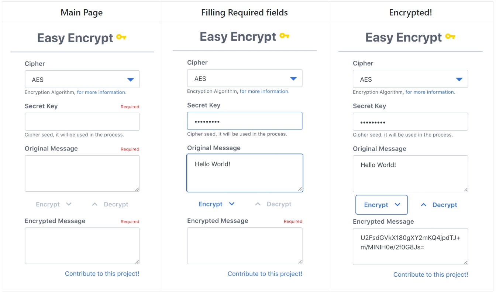

Sometimes the Chrome Store doesn't have the extension you really want or maybe there is a few already built but they're really bad, but you think that in order to build an extension you need some kind of knowledge in a special language of theirs. Let me tell you that if you know how to create a Web Application with React then you're a Chrome Extension developer too! :astonished:


<a style="background-color:black;color:white;text-decoration:none;padding:4px 6px;font-family:-apple-system, BlinkMacSystemFont, &quot;San Francisco&quot;, &quot;Helvetica Neue&quot;, Helvetica, Ubuntu, Roboto, Noto, &quot;Segoe UI&quot;, Arial, sans-serif;font-size:12px;font-weight:bold;line-height:1.2;display:inline-block;border-radius:3px" href="https://unsplash.com/@mikepetrucci?utm_medium=referral&amp;utm_campaign=photographer-credit&amp;utm_content=creditBadge" target="_blank" rel="noopener noreferrer" title="Download free do whatever you want high-resolution photos from Mike Petrucci"><span style="display:inline-block;padding:2px 3px"><svg xmlns="http://www.w3.org/2000/svg" style="height:12px;width:auto;position:relative;vertical-align:middle;top:-1px;fill:white" viewBox="0 0 32 32"><title>unsplash-logo</title><path d="M20.8 18.1c0 2.7-2.2 4.8-4.8 4.8s-4.8-2.1-4.8-4.8c0-2.7 2.2-4.8 4.8-4.8 2.7.1 4.8 2.2 4.8 4.8zm11.2-7.4v14.9c0 2.3-1.9 4.3-4.3 4.3h-23.4c-2.4 0-4.3-1.9-4.3-4.3v-15c0-2.3 1.9-4.3 4.3-4.3h3.7l.8-2.3c.4-1.1 1.7-2 2.9-2h8.6c1.2 0 2.5.9 2.9 2l.8 2.4h3.7c2.4 0 4.3 1.9 4.3 4.3zm-8.6 7.5c0-4.1-3.3-7.5-7.5-7.5-4.1 0-7.5 3.4-7.5 7.5s3.3 7.5 7.5 7.5c4.2-.1 7.5-3.4 7.5-7.5z"></path></svg></span><span style="display:inline-block;padding:2px 3px">Mike Petrucci</span></a>

## Setting up the project :tools:

When working with there is plenty of options to set up the workspace. In this case, I'm going to use CRA ([create-react-app](https://github.com/facebook/create-react-app)) just because of its simplicity! So let's start by installing the package and creating our project.

```sh
npm install -g create-react-app
create-react-app my-first-chrome-extension
```

It will create a directory called `my-first-chrome-extension` inside the current folder. Inside that directory, it will generate the initial project structure and install the transitive dependencies:

```
my-first-chrome-extension
├── README.md
├── node_modules
├── package.json
├── .gitignore
├── public
│   ├── favicon.ico
│   ├── index.html
│   └── manifest.json
└── src
    ├── App.css
    ├── App.js
    ├── App.test.js
    ├── index.css
    ├── index.js
    ├── logo.svg
    └── registerServiceWorker.js
```

This is the last step for a minimal workspace configuration when working on the web, but for this experiment, we need to add one more :nerd_face:. Chrome extensions need to have a `manifest.json` file in the root folder, it provides important information of our extension like name, permissions, current version and the list continues...

This is the minimal configuration for a Chrome extension:

```json
{
  "manifest_version": 2,
  "name": "APP_NAME",
  "description": "APP_DESCRIPTION",
  "version": "1.0.0",
  "icons": {
    "16": "app_icon.png",
    "48": "app_icon.png",
    "128": "app_icon.png"
  },
  "browser_action": {
    "default_popup": "index.html",
    "default_title": "Open the popup"
  },
  "permissions": []
}
```

One important thing to remark is create-react-app already includes a `manifest.json` file in the public folder, so you need to update it with the information from above.

The entry point of my extension is located in the `browser_action` object, where I told Chrome that my extension will open a popup and open `index.html`.

## Opening my extension inside Chrome :earth_americas:

As any React application in order to ship it first, we need to build it. For that we run this command in our console:

```sh
npm run build
```

This will create a `build` folder inside our project, where we have our optimized application ready to be open with Chrome! To do that we need to open my Chrome extension by running the following URL on a tab:

```
chrome://extensions/
```

Then we click on Load Unpacked and then look for our `build` folder.



If everything went OK, you should be able to see your application icon in the Extension Bar and by clicking on it a popup should appear with the CRA Hello page :muscle:



## Development Experience :computer:

The cool thing about building an extension with React is that we keep having the awesomeness development experience like having Hot Reloading, npm, ES6, etc. So in order to start coding our extension, we just run.

```
npm start
```

This will open a new tab in our browser with Home Page and we're ready to start building our extension, we don't need to run it inside a Chrome (as an extension). **DISCLAIMER: In case you need any Chrome extension API you may have to run it as an extension in order to have access to them.**

One thing I suggest to do is to change the `width` of our application due to by default it'll take the full width so if we have a wide resolution like (1920x1080) you are going to see everything really wide and the final result won't match with this one. I use `width: 20em`, but that really depends on you.

After you've coded all the features for your extension, you can repeat the Load process the times you want to see how it looks on a Chrome Popup :sparkles:

## Put it in the store! :package:

Now you have your extension running on your Chrome (locally), but what happens if you want to share it with a friend or with the community? You have to send the build folder manually, and maybe that it's not the best way to do this. This is where the Chrome Store appears! Let's open this URL in your browser:

```
https://chrome.google.com/webstore/developer/dashboard
```

The first thing I noticed is that, yes in order to upload an extension first you need to pay a fee :disappointed:. Fortunately is a one time pay and it costs US$5.00, so it's not that much!


_Default Dashboard_

After that, I highly suggest using the new Developer Dashboard, because the default is tremendously horrible! :scream: The new one uses Material Design and in my opinion is much more intuitive and nicer.


_New Dashboard_

In order to upload the extension first, we need to _zip_ the `build` folder, to do so you can use whatever application you want, in my case I use the Zip functionality of Windows. Then click on `NEW ITEM` and upload the zip file, you'll notice that some fields are already filled in like name and description, the rest have to be manually complete.


_Example of Store_

After you've filled all the required fields you're ready to Publish your first extension and see it on the Store! :metal: One thing, don't scary if you are not able to find it using the Google search it takes a few days or maybe weeks to be discoverable.

## My Experience

Remember that I said that sometimes the extension you're looking for is not inside the Chrome Store? Well, that's my case, I really want to have an extension to encrypt and decrypt a message (JUST THAT), the ones inside the store didn't quite match my requirements.

Because of that, I build [Easy Encrypt](https://chrome.google.com/webstore/detail/easy-encrypt/pdpinaffkgjneengfdgoohjipndeopcn), an offline cipher which can encrypt and decrypt a message using different Encryption Algorithm. Easy Encrypt is a free Extension and an Open Source project hosted in [Github](https://github.com/EmaSuriano/chrome-easy-decrypt), so any contribution is really appreciated! Also, you can use it as a real example :grinning: Here it's some screenshots using it.



I was able to create this chrome extension in just a few days, which really surprised me! So if you're scared of coding for another platform, just remember it's the same old React we all known :laughing:

---

I hope that this post has encouraged you to create your own chrome extension! Let’s keep building stuff together :construction_worker:

### Refs:

* [create-react-app](https://github.com/facebook/create-react-app)
* [Manifest file Documentation](https://developer.chrome.com/apps/manifest)
* [Easy Encrypt - Chrome Extension](https://chrome.google.com/webstore/detail/easy-encrypt/pdpinaffkgjneengfdgoohjipndeopcn)
* [Easy Encrypt - Repository](https://github.com/EmaSuriano/chrome-easy-decrypt)
* [Building a Chrome Extension Using React](https://medium.com/@gilfink/building-a-chrome-extension-using-react-c5bfe45aaf36)
