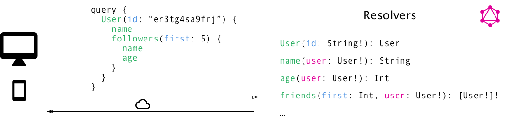

FOTITO FACHERA PARA EL ARTICULO

Nowadays every application is connected to a server. That server could be sending the data using different protocols (HTTP, FTP, HTTPS) and designs (SOAP, REST, something similar to REST :laughing:), our application has to deal with that so for that we always would like to have a service layer inside our architechture.

Let's see a simple example of them:

```javascript
const myService = await params => {
  const requestParams = adaptParamsForRequest(params);
  const response = fetch(MY_SERVICE_URL, {
    headers: SERVICE_HEADERS,
    method: SERVICE_METHOD,
    body: requestParams,
    ...more
  });

  return parseResponse(response);
}
```

This kind of service layer has some disavantages:

* Perfomance issues because of the adapting and parsing
* The web application has to know the protocol and design the service is following.
* It may happens that in order to get more information, we would need to perform another requests.
* It could happened that we don't need all the information inside the response, the parser would do that job but we shouldn't ask for it in the first if we won't use in the future.

GraphQL could help in all of these points! But first we need to understand what GraphQL is ..

## What is GraphQL?

If we check the oficial documentation, we would find something like this:

> GraphQL is a query language for APIs and a runtime for fulfilling those queries with your existing data. GraphQL provides a complete and understandable description of the data in your API, gives clients the power to ask for exactly what they need and nothing more, makes it easier to evolve APIs over time, and enables powerful developer tools.


Let's calm down and see what they are saying

### GraphQL is a query language for APIs

Let's first know what is a query language?

> Query Language (QL) refers to any computer programming language that requests and retrieves data from database and information systems by sending queries.

Okay so if GraphQL is a language, what are their rules? Due to GraphQL isn't tied to any specific database or storage engine, it has its own type system that’s used to define the schema of an API.

#### Schema

An `Schema` specifies the capabilities of the API and defines how clients can request the data. It is often seen as a contract between the server and client. The syntax for writing schemas is called Schema Definition Language (SDL).

```graphql
type Car {
  patent: String!
  color: String!
}
```

`Car` is an `ObjectType` which defines the structure of a car model in our application using `ScalarTypes`, it should have a patent which is a string and also an color which is a string, both are mandatory.

One thing to remark is that `ObjectType` or `ScalarTypes` don’t expose any functionality to client applications, for that we should define our entry points for our server.

#### Query Type

Queries are used by the client to request the data it needs from the server. Unlike REST APIs where there’s a clearly defined structure of information returned from each endpoint, GraphQL always exposes only one endpoint, allowing the client to decide what data it really needs from a predefined pattern.

Let’s take a look at an example query that a client could send to a server:

```graqphql
{
  allCars {
    patent
  }
}
```

This would return a list of all cars currently stored inside my server, with the following shape:

```graqphql
{
  "data": {
    "allCars": [
      {
        "patent": "ABC 123"
      },
      {
        "patent": "BQK 893"
      },
      {
        "patent": "POI 098"
      }
    ]
  }
}
```

In GraphQL, each field can have zero or more arguments if that’s specified in the schema, by doing this we are able to query the amount of fields returned and also select the fields we want!

```graqphql
{
  allCars(last: 2) {
    patent
  }
}
```

#### Mutation Type

The majority of applications also need some way of making changes to the data that’s currently stored in the backend. In GraphQL, these changes receive the name of `mutations` and they can be used for:

* Create new data
* Update existing data
* Delete existing data

The syntax for mutations look almost the same as queries, but they must start with the mutation keyword.

```graqphql
mutation {
  createCar(patent: “QWE 112”, color: “red”) {
    patent
    color
  }
}
```

#### Subscription Type

In case you want to establish a realtime connection to the server in order to get notified after important events, GraphQL offers the concept of Subscriptions. When a client subcribes to an event, it will establish an steady connection with the server, and whenever a particular event happens, the server pushes the corresponding data to the client.

They are written using the same syntax as queries, but stating with the subscription keyword.

```graphql
subscription {
  newCar {
    patent
  }
}
```

When a new mutation is performed that creates a new `Car`, the server will send the information directly to the subcribed clients.

```graphql
 "newCar": {
    "patent": "IUY 784",
  }
```

### GraphQL is a runtime for fulfilling those queries with your existing data

GraphQL itself does not provide any information or data, it will receive the query/mutation from the client and `resolve` it by communication with its entities.

GraphQL is able to communicate with lots of different kind of entities, they could be a SQL or NoSQL databases, REST APIs, 3rd-party APIs, legacy systems or even other GraphQL APIs. If we combine a local database with 2 external services we could endup with the following architechture.


But how do we retrieve information from those services if all of them could be different? It wasn't an accident to use the word resolve in the above sentence :P Let me introduce Resolvers!

#### Resolvers

As we know, a query/mutation/subscription consists of a set of fields. In the GraphQL server implementation, each of these fields actually corresponds to exactly one function that’s called a `resolver`. The sole purpose of a `resolver` function is to fetch the data for its field.

Once all resolvers returned, the server will gather all the data in the format that was described by the query and sent it back to the client.



As each field has it owns reducer, we can easily combined the response of different services.

```javascript
const CarResolver = {
  patent: async ({ id }) => {
    const patent = await getPatentFromDb(id);
    return patent;
  },
  owner: async ({ id }) => {
    const owner = await fetch(getOwnerInformatioById(id));
    return owner;
  }
};
```

## GraphQL is not a framework

I already exaplained what GraphQL is, and in any time I mentioned anything about framework or library. So let's see how we can implement GraphQL!

GraphQL-js is the official implementation of the stantard, by using it we ca defined the Schema, Type, resolvers, etc.

Explain more of this!!

## Uses Cases

So this is great, this sounds like an excellent framework so why does everyone is building GraphQL server?

The simple question is because maybe we don't need it in most cases, and maybe using REST is enough to build a good software quality. I like to think that GraphQL is a MUST in these cases:

* Connection with multiple services: it'll work as a facade, it will coopeate between the different services without any problem.
* Wrap a response from a server: it could be times when you have to communicate with an endpoint, and the response of it is not correctly formatted.
* Different client platform: this when SDL delights me, when you are working on different platform it's very common to display different information, so just by specifying them inside the query will be enough.

I'm sure that must be more cases, these are the most important in my opinion so in order to not let the list longer I just chose only these.

## My experience

It won't be a full article if I didn't write my experience using it! Considering the uses cases described above, I was in the 2nd case: I need to build an application that will fetch for gnomes, display them inside a list and when clicking view the information of one them.

I named this project [brastlewark-finder](https://github.com/EmaSuriano/brastlewark-finder). I will explained the whole process of adding GraphQL to a project from scratch.


### Context

Let's take a look at the endpoint they gave me. It returns a list of 1336 items with the following structure.

```json
{
  "id": 0,
  "name": "Tobus Quickwhistle",
  "thumbnail":
"http://www.publicdomainpictures.net/pictures/10000/nahled/thinking-monkey-11282237747K8xB.jpg",
  "age": 306,
  "weight": 39.065952,
  "height": 107.75835,
  "hair_color": "Pink",
  "professions": [
    "Metalworker",
    "Woodcarver",
    "Stonecarver",
    " Tinker",
    "Tailor",
    "Potter"
  ],
  "friends": ["Cogwitz Chillwidget", "Tinadette Chillbuster"]
},
```

The first thing I noticed was I didn't have a way to get the information of a friend without filtering by name the whole array from the response. This will lead to serious performance issues and a really bad UX.

So I decided to wrap this endpoint with a GraphQL server!

### Implementation

As I explained before, you have to decide which implementation of GraphQL you'll use to get up and running your server. I decided to use [Micro](https://github.com/zeit/micro) by Zeit and [Apollo server](https://github.com/apollographql/apollo-server) because of the very well explained examples.

#### Server definition

The entry of our server is the instantiation of Micro and adding the routes for our GraphQL server. This is what you'll find inside the Apollo's examples.

```javascript
import { microGraphiql, microGraphql } from 'apollo-server-micro';
import cors from 'micro-cors';
import micro, { send } from 'micro';
import { get, post, router } from 'microrouter';
import schema from './schema';

const graphqlHandler = microGraphql({ schema });
const graphiqlHandler = microGraphiql({ endpointURL: '/graphql' });

const corsUpdater = cors();

const server = micro(
  corsUpdater(
    router(
      get('/graphql', graphqlHandler),
      post('/graphql', graphqlHandler),
      get('/graphiql', graphiqlHandler),
      (req, res) => send(res, 404, 'not found')
    )
  )
);

server.listen(3001, () => {
  console.log(`Go to http://localhost:${3001}/graphiql to run queries!`);
});
```

#### GraphQL Schema

## Related links

* https://blog.graph.cool/graphql-server-basics-the-schema-ac5e2950214e
* https://blog.graph.cool/how-to-wrap-a-rest-api-with-graphql-8bf3fb17547d
  https://blog.graph.cool/top-5-reasons-to-use-graphql-b60cfa683511
