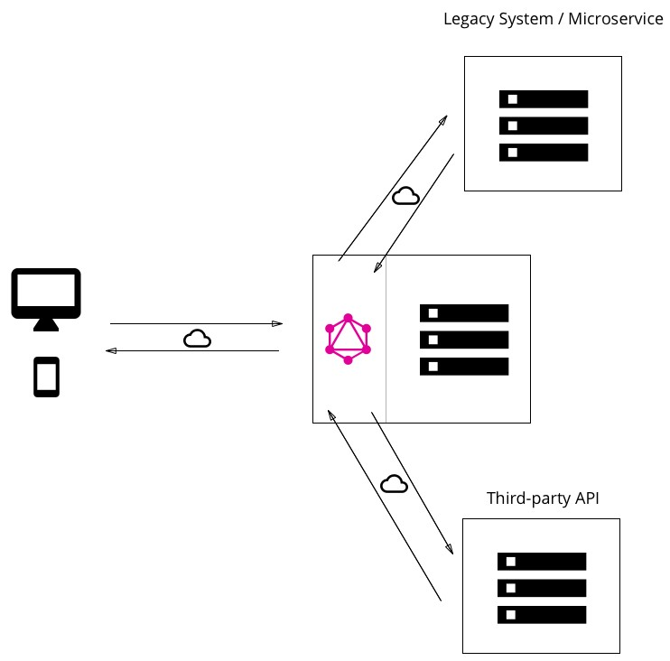
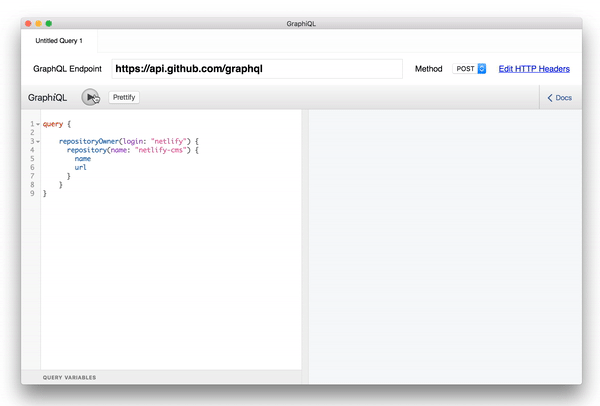

Nowadays every application is connected to a server. That server could be sending the data using different protocols (HTTP, FTP, HTTPS) and designs (SOAP, REST, something similar to REST :laughing:), and our application has to deal with that so for that reason we would always like to have a service layer inside our architecture.


Photo by [Anaïs Redant](https://unsplash.com/photos/HzfeNUVpLLU?utm_source=unsplash&utm_medium=referral&utm_content=creditCopyText) on [Unsplash](https://unsplash.com/@redanais?utm_source=unsplash&utm_medium=referral&utm_content=creditCopyText)

---

Let's see a common implementation of a service layer:

```javascript
const myService = await params => {
 const requestParams = adaptParamsForRequest(params);
 const response = fetch(MY_SERVICE_URL, {
   headers: SERVICE_HEADERS,
   method: SERVICE_METHOD,
   body: requestParams,
   ...more
 });

 return parseResponse(response);
}
```

This kind of service layer has some disadvantages:

* Performance issues because of the adapting and parsing the data.
* The web application has to know the protocol and design the API is using (HTTP, FTP, etc.).
* It may happen that in order to get more information, we would need to perform another request or maybe more than just one.
* It could happen that we don't need all the information inside the response, the parser will do that job but we shouldn't ask for it in the first place if we won't use it in the future.

GraphQL could be helpful in all of these points! But first we need to understand what it is ..

## GraphQ what!? :thinking:

If we check the official documentation, we will find something like this:

> GraphQL is a query language for APIs and a runtime for fulfilling those queries with your existing data. GraphQL provides a complete and understandable description of the data in your API, gives clients the power to ask for exactly what they need and nothing more, makes it easier to evolve APIs over time, and enables powerful developer tools.


Wow that was a lot of information! Let's calm down and see what they are talking about :pray:

### GraphQL is a query language for APIs

Let's see the definition of a [Query Language](https://www.techopedia.com/definition/3948/query-language) :nerd_face:

> Query language refers to any computer programming language that requests and retrieves data from database and information systems by sending queries.

To sum up, GraphQL is a language that allow us to get and send data to a database or _something_ out there (we'll see what “something” means in next sections). Every language has a set of rules which define it, in GraphQL this is called Schema.

#### Schema :brain:

A `Schema` is the contract between the server and client, it specifies the capabilities of the API and defines how clients interact with the data. The syntax for writing schemas is called [Schema Definition Language (SDL)](https://blog.graph.cool/graphql-sdl-schema-definition-language-6755bcb9ce51).

Basically, SDL has two main components

* Type: has a name and can extends one or more interfaces.

```graphql
type Post implements Item {
  # ...
}
```

* Field: has a name and a type.

```graphql
  age: Int
```

If we merge both concepts, we can declare our first `ObjectType`!

```graphql
type Car {
  patent: String!
  color: String!
}
```

`Car` type defines the structure of a car model in our application using [`ScalarTypes`](https://graphql.org/learn/schema/#scalar-types), it should have a patent and color properties both must be string and mandatory.

One thing to remark is that `ObjectType` or `ScalarTypes` don’t expose any functionality to client applications, for that we should define our _entry points_ for our server.

#### Query Type :mag:

`Queries` are used by the client to request the data it needs from the server. Unlike REST APIs where there’s a clearly defined structure of information returned from each endpoint, GraphQL always exposes only one endpoint, allowing the client to decide what data it really needs!

Let's suppose we have a query which returns all the cars with its respective information, but the client only wants to retrieve the patent of them and nothing else. So, we could perform the following query:

```graqphql
{
 allCars {
   patent
 }
}
```

This would return a list of all cars currently stored on my server, with the following shape:

```graqphql
{
 "data": {
   "allCars": [
     {
       "patent": "ABC 123"
     },
     {
       "patent": "BQK 893"
     },
     {
       "patent": "POI 098"
     }
   ]
 }
}
```

#### Mutation Type :chains:

`Mutations` allow the client to make changes to data stored inside server. These changes could be:

* Create new data
* Update existing data
* Delete existing data

The syntax for mutations looks almost the same as queries but they must start with the mutation keyword.

```graqphql
mutation {
 createCar(patent: “QWE 112”, color: “red”) {
   patent
   color
 }
}
```

#### Subscription Type :envelope_with_arrow:

`Subscription` gives the client the possibility to establish a real-time connection to the server in order to get notified after important events. Whenever a particular event happens, the server pushes the corresponding data to the client.

They are written using the same syntax as queries, but starting with the subscription keyword.

```graphql
subscription {
  createCar {
    patent
  }
}
```

### GraphQL is a runtime for fulfilling those queries with your existing data

GraphQL itself does not provide any information or data, it will receive a `query` or a `mutation` from the client and `resolve` it by communication with its entities. It is able to communicate with lots of different kind of entities, they could be a `SQL` or `NoSQL` databases, REST APIs, 3rd-party APIs, legacy systems or even other GraphQL APIs.

If we combine a local database with 2 external services we could end up with the following architecture.



But how do we retrieve information from those services if all of them could be different? It wasn't an accident to use the word resolve in the above sentence :stuck_out_tongue_winking_eye: Let me introduce Resolvers!

#### Resolvers :satellite:

As we know, a `query`/`mutation`/`subscription` consists of a set of fields. In the GraphQL server implementation, each of these fields actually corresponds to exactly one function that’s called a `resolver`.

The sole purpose of a `resolver` function is to fetch the data for its field. As each field has it owns reducer, we can easily combine the response of different services.

```javascript
const CarResolver = {
  patent: async ({ id }) => {
    const patent = await getPatentFromDb(id);
    return patent;
  },
  owner: async ({ id }) => {
    const owner = await fetch(getOwnerInformatioById(id));
    return owner;
  }
};
```

Once all `resolvers` returned, the server will gather all the data in the format that was described by the query and sent it back to the client.

## GraphQL Tools :wrench:

GraphQL was released in 2015, and there are many tools out there which will help you build your own server, but there is only one which you must have. Its name is [GraphiQL](https://github.com/graphql/graphiql).

GraphiQL allows its users to test and present GraphQL APIs by providing a graphic interface that facilitates performing queries and mutations. It uses schema to provide information about data structure and types, and it also supports autocompletion.

I like to see it as the merge between Postman and Swagger :laughing:



## GraphQL is not a framework :no_entry:

I already explained what GraphQL is, but I didn’t mention anything about a framework or a library. So let's see how we can implement GraphQL!

Depending on the server you want to run GraphQL, you will have to install a dependency for your specific technology. For Example, if you're running an `express` backend, then you have to install `express-graphql`. Same goes for `happy`, `koa`, etc.

I really want to mention that there is a really big company which is betting a lot in GraphQL called **Apollo**. They have built an incredible amount of helpful libraries to get up and running your own GraphQL server and also connect it to your client. Please [check them out](https://www.apollographql.com/)!

## Use Cases :muscle:

So this is great, this sounds like an excellent technology so why doesn’t everyone is building GraphQL server? :thinking:

The simple answer is because maybe we don't need it in most cases, and maybe building a REST server is enough to build a software with good quality. I like to think that GraphQL is a MUST in these cases:

* **Connection with multiple services**: it will cooperate with the different services without any problem, similar to a facade.
* **Wrap a response from a server**: it could happen that you have to communicate with an endpoint, and its response is not correctly formatted.
* **Different client platforms**: when you are working on several platforms it's very common to display different information, so just by specifying them inside the query will be enough (this is when SDL delights me).

I'm sure that there must be more cases, but these in my opinion are the most important, so in order to keep the list short I just choose these 3.

## My experience :bulb:

It won't be a full article if I didn't write my experience using it! Considering the uses cases described above, I was in the 2nd case: I need to build an application that will fetch for gnomes, display them inside a list and when clicking view the information of one them.

I named this project [brastlewark-finder](https://github.com/EmaSuriano/brastlewark-finder). I will explain the whole process of adding GraphQL to a project from scratch.


### Context

Let's take a look at the endpoint they gave me. It returns a list of 1336 items with the following structure.

```json
{
  "Brastlewark": [
    {
      "id": 0,
      "name": "Tobus Quickwhistle",
      "thumbnail":
        "http://www.publicdomainpictures.net/pictures/10000/nahled/thinking-monkey-11282237747K8xB.jpg",
      "age": 306,
      "weight": 39.065952,
      "height": 107.75835,
      "hair_color": "Pink",
      "professions": [
        "Metalworker",
        "Woodcarver",
        "Stonecarver",
        " Tinker",
        "Tailor",
        "Potter"
      ],
      "friends": ["Cogwitz Chillwidget", "Tinadette Chillbuster"]
    },
    {
      "id": 1
    }
  ]
}
```

The first thing I noticed was I didn't have a way to get the information of a friend without filtering by `name` the whole array from the response. A possible implementation using old style `fetch` could be:

```javascript
const getGnomes = () => fetch('gnomeURL'); //will return the whole list of gnomes

const getGnomeById = (id, loadFriends = true) => {
  const gnome = getGnomes().then(gnomes => {
    const result = gnomes.filter(gnome => gnome.id === id);
    if (loadFriends) {
      const friendsId = gnomes
        .filter(({ name }) => result.friends.includes(name))
        .map(gnome => gnome.id);
      result.friends = Promise.all(
        friendsId.map(id => getGnomeById(id, false))
      );
    }
    return result;
  });
};
```

As you can see, this will lead to serious performance issues and a really bad UX. There may be some improvements that can be made, but I saw that this was the perfect match for GraphQL. Now, let’s look the same result but in this case, using a `Query` from GraphQL!

```javascript
export const GET_GNOME_BY_ID = gql`
  query getGnomeById($id: ID!) {
    gnome(id: $id) {
      name
      thumbnail
      age
      weight
      height
      hair_color
      professions
      friends {
        id
        name
        thumbnail
        professions
      }
    }
  }
`;
```


### Implementation :construction_worker:

As I said before, you have to decide which implementation are you going to use to get up and running your server. I decided to use [Micro](https://github.com/zeit/micro) by Zeit and [Apollo server](https://github.com/apollographql/apollo-server) because of the very well explained examples they have.

You can try out the final version of the GraphQL server via GraphiQL [here!](https://brastlewark-finder-sotqubsuzd.now.sh/graphiql)

#### Server definition

The entry of our server is the instantiation of Micro and adding the routes for our GraphQL server. This is mainly what you'll find inside the Apollo's examples.

```javascript
import { microGraphiql, microGraphql } from 'apollo-server-micro';
import cors from 'micro-cors';
import micro, { send } from 'micro';
import { get, post, router } from 'microrouter';
import schema from './schema';

const graphqlHandler = microGraphql({ schema });
const graphiqlHandler = microGraphiql({ endpointURL: '/graphql' });

const corsUpdater = cors();

const server = micro(
  corsUpdater(
    router(
      get('/graphql', graphqlHandler),
      post('/graphql', graphqlHandler),
      get('/graphiql', graphiqlHandler),
      (req, res) => send(res, 404, 'not found')
    )
  )
);

server.listen(3001, () => {
  console.log(`Go to http://localhost:${3001}/graphiql to run queries!`);
});
```

#### GraphQL Schema

As we know the schema is where we defined the structure for our GraphQL server. When we called `makeExecutableSchema` we should send all the Type Definitions (`QueryType`, `ObjectType`, `MutationType`, etc.) of our server and also their respective resolvers.

Inside `typeDefs` I defined:

* `Gnome`: This is the `ObjectType` to represent the Gnome entity inside the server, it stores all the relevant information for a gnome and will be the object sent to the client.
* Queries:
* `allGnomes`: receives the criteria for filtering the gnomes (name and an array of professions) and will return an array of `Gnomes`.
* `gnome`: receives an id (Mandatory field) and returns the `Gnome` with that Id.

Each of the fields inside the `Gnome` ObjectType are resolved automatically when the key of the object returned by the service matched, except for friends! If you take a look inside the resolver, you'll see that `Gnome` redefined the function of getting Gnome friends, this is super useful because we can modify the data that comes from the server in a really easy way :smiley:

```javascript
import { makeExecutableSchema } from 'graphql-tools';
import { getGnomes, getGnomeById } from './query';

const typeDefs = `
 type Query { allGnomes(name: String, professions: [String]): [Gnome], gnome(id: ID!): Gnome }
 type Gnome {
   id: ID!,
   name: String,
   thumbnail: String,
   age: Int,
   weight: Float,
   height: Float,
   hair_color: String,
   professions: [String],
   friends: [Gnome],
   createdAt: Int,
 }
`;

const resolvers = {
  Query: { allGnomes: getGnomes, gnome: getGnomeById },
  Gnome: {
    friends: async ({ friends }) => {
      const gnomes = await getGnomes();
      return gnomes.filter(({ name }) => friends.includes(name));
    }
  }
};

export default makeExecutableSchema({
  typeDefs,
  resolvers
});
```

#### Query

This is where we get the data from our API non-REST, also apply the logic of filtering by name and/or professions. I'm using memoize just to avoid fetching more than one time the same resource, due to it will always return the same data ...

```javascript
import fetch from 'node-fetch';
import memoize from 'fast-memoize';
import BASE_URL from './constants';

const fetchGnomes = memoize(async () => {
  const rawData = await fetch(BASE_URL);
  const jsonData = await rawData.json();
  return jsonData.Brastlewark;
});

const getGnomes = async (_, args) => {
  const gnomes = await fetchGnomes();
  if (!args) return gnomes;

  const { name = '', professions = [] } = args;
  return gnomes.filter(
    gnome =>
      (!name || new RegExp(name, 'i').test(gnome.name)) &&
      (!professions.length ||
        professions.every(prof => gnome.professions.includes(prof)))
  );
};

const getGnomeById = async (_, { id }) => {
  const gnomes = await fetchGnomes();
  return gnomes.find(gnome => gnome.id == id);
};

export { getGnomes, getGnomeById };
```

---

I really enjoyed working with GraphQL and the implementation with Apollo, when you get to the that point where everything is connected the development is awesome! :star_struck:

I hope that this post has encouraged you to implement your own GraphQL server! Let’s keep building stuff together :construction_worker:

## Related links

* [Introduction to GraphQL](http://graphql.org/learn/)
* [The Fullstack Tutorial for GraphQL](https://www.howtographql.com)
* [GraphQL Concepts Visualized](https://dev-blog.apollodata.com/the-concepts-of-graphql-bc68bd819be3)
* [GraphQL Server Basics](https://blog.graph.cool/graphql-server-basics-the-schema-ac5e2950214e)
* [How to wrap a REST API with GraphQL](https://blog.graph.cool/how-to-wrap-a-rest-api-with-graphql-8bf3fb17547d)
* [Top 5 Reasons to Use GraphQL](https://blog.graph.cool/top-5-reasons-to-use-graphql-b60cfa683511)
