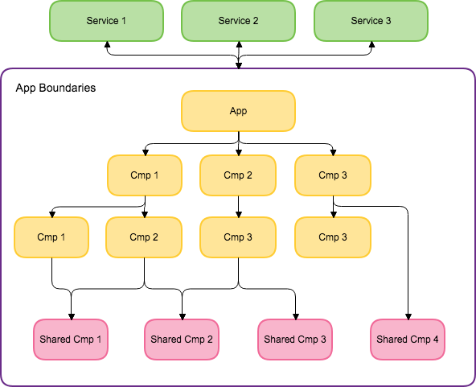

For a long time, thinking of writting tests for the UI was a really crazy idea due to its lack of complexity. But in the times we're living a web application is responsible of doing lots of things, for example fetching information from a service, then doing some calculation with it and then display it inside a table.

All the logic inside a web application can be tested, the tests can be separated into different layers each one has different purpouse and approaches.

As those applications have more responsability, we need to make sure that they continue working as expected after a change was introduced in the codebase. When dealing And that's why we're here to talk!

## Aplication Structure Overview

As I said, todays application are more than a simple static site with some css just to look nice. Normally they communicate with some kind of service by sending or receiving information and then do something with that.
Also, most of them are built thinking in component, using any popular framework like React, Angular, Vue, etc. so we can achieve to have this schema of communication.

