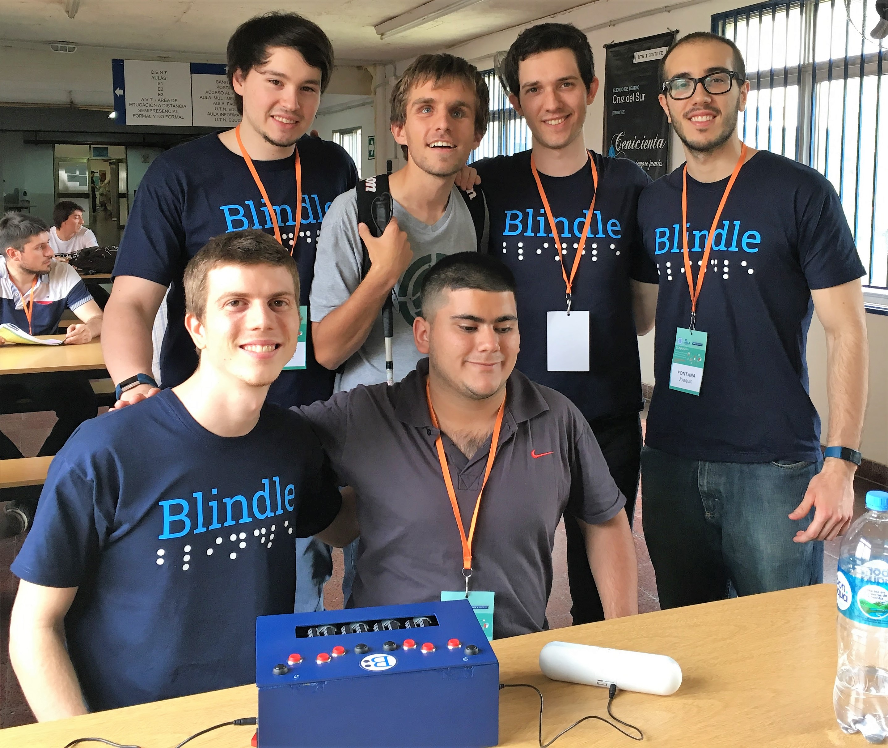

Hello! :wave: I’m Emanuel Suriano, I live in Buenos Aires, Argentina :argentina: and I’m a Software developer, more specifically Web Developer.

I’m in love with Javascript and all the ecosystem that has grown around it: frameworks, dev tools, the community and more important all the excellent Open Source projects out there! Because of that passion of mine,I built all sort of things with this language:

* Web Applications
* IoT
* Mobile applications
* Libraries

When I'm not working, I am committed to the #100DaysOfCode challenge, which main goal consist in coding at least 1 hour every day :muscle: This has made me a much more productive person and enforced me to make lots of new projects with the latests frameworks. You can check my journey inside [this GitHub page](https://emasuriano.github.io/100-days-of-code/) that it's linked to my repository of 100-days-of-code. I highly recommend any developer to try this out!

One of my biggest achievements happened in 2017, when I started a project called Blindle with 3 friends from College. The idea behind it was to provide an accessible Braille learning device, so any person could learn to read and write in Braille with this device. And the best part is that is totally Open Source, thus everything related to the project is on GitHub in case anyone wants to create a Blindle of his own :smile:

_Blindle team with its first users!_
