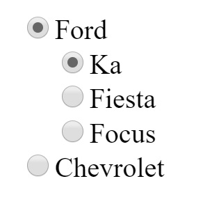
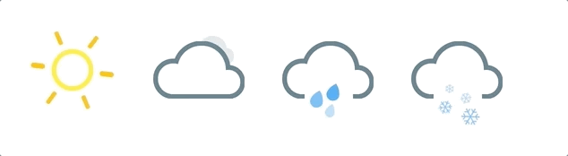

While I'm not working I like to develop libraries, web applications, collaborate in Open Source projects, etc.

##runner-tracker 

**Description:** Web application to see who are the fastest runner given an amount of meters.

**Context:** This is a simple async aplication that will serve as an example of how to properly react/redux written Unit, Integration and End to End Test. Also, this repository is much more enriching when you take a look at the presentation that I made with a co-worker.

##react-radio-group-context 

**Description:** Radio Group Component for React written with the new Context API

**Context:** This library was the result of learning the new Context API that was released in React 16.3.2. Also, I wrote a blog post called [Understanding the new context api](/posts/understanding-the-new-context-api/) where I described my experience of using it and I made a [presentation](https://slides.com/emasuriano/understanding-context-api/) to all my co-workers in my job in order to exlain my thoughs about it.

##rgb-led-wifi 

**Description:** RGB led strip manager via wifi using a nodemcu chip that has a wifi receptor and runs a node server.

**Context:** I wanted to manage my RGB LED strip with my mobile phone, so I used a library called Jhonny-Five that can communicate with the led strip using Javascript. This is currently implemented in bedroom :smile:

##slack-bot-web-socket 

**Description:** The application will try to connect to a channel of slack called "testbot" (using the Real Time Messaging API from slack).

**Context:** I was asked to implement a slack bot for an interview. I find this exercise pretty fun and a cool way to check a dev skills, so I upload it to GitHub.

##react-hotkey-tooltip 

**Description:** React component that creates hotkeys for your components and shows a tooltip of it

**Context:** I was in a project that must implement a hotkey system and also the user should know which key combination is available to use. So I created this library so any developer that need to do this won't have to re-invent the wheel!

##weather-styled-icon 

**Description:** Animated and configurable weather icons made in React.

**Context:** I was doing a weather application using static of weather, I searched for weather icons built in React and I didn't find anything. So I made this library that gives you 4 weather icons totally configurable via props.

##weather-app-integration-test-cosmos 

**Description:** Small react/redux weather application that fetch the forecast for the next 6 days given the Geo Location.

**Context:** The goal of this repository is to try react-cosmos which is a framework to perform integration test thinking in Redux isolation. I got 100% coverage by coding Unit Test and Integration Test.

##roller-blinds-wifi 

**Description:** Project to control your roller blinds using a stepper motor and a mobile/web application (Client and Server app).

**Context:** With 2 friends we start a side project to control a roller blinds using JUST javascript. The idea was then to make a presentation inside our job to show our learning.

##[Blindle](https://github.com/Blindle)

**Description:** An accesible Braille learning device.

**Context:** This is the final project in order to get my degree in Software Engineering. I made this project with 3 friends of the collage. Basically it's a physical box withc which a blind person can learn to write, read and evaluate himself in the Braille language. For more information, check its [home page](http://blindle.github.io).
